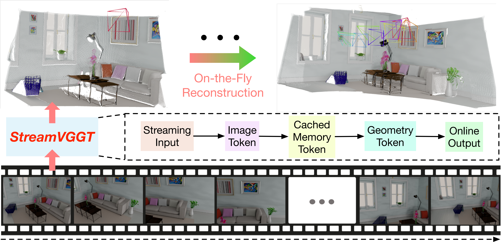

# StarStream — RGB + Event Fusion for 4D Visual-Geometric Perception

<p align="center">
  
</p>

**StarStream** extends [StreamVGGT](https://github.com/wzzheng/StreamVGGT) with **event camera** fusion, enabling robust 4D visual-geometric perception under challenging conditions (low-light, high dynamic range, fast motion). The student model (`StreamVGGT`) learns from a frozen [VGGT](https://github.com/facebookresearch/vggt) teacher via hybrid supervision, combining dataset ground-truth with teacher distillation.

## Highlights

- **Cross-Attention Event Fusion** — `EventPatchEmbed` + `CrossAttnFuse` with optional SNR x event-density prior for quality-aware fusion
- **Hybrid Supervision** (`GtPoseDistillLoss`) — GT pose + DA3 depth when available, teacher distillation fallback, plus pose self-consistency and event brightness-constancy losses
- **3-Phase Curriculum Learning** — clean warmup → low-light ramp → real data injection, with dark levels and real-data ratio ramping in parallel
- **NVS Validation** — Novel View Synthesis via `gsplat` rendering, tracked by PSNR / SSIM / LPIPS
- **Multi-Dataset Support** — DL3DV (simulated), M3ED (real events), DSEC (real driving)
- **Distributed Training** — Accelerate FSDP + BF16, with preflight validation, mid-epoch checkpointing, and deterministic eval

---

## Quick Start

```bash
# 1. Environment
conda create -n StreamVGGT python=3.11 cmake=3.14.0
conda activate StreamVGGT
pip install -r requirements.txt

# 2. Download VGGT weights → ckpt/model.pt
#    https://github.com/facebookresearch/vggt

# 3. Train (2-GPU example)
cd src/
bash train.sh 0,1 train_M3ed_curriculum_0419_8gpu
```

---

## Architecture

```
Input: [RGB Image + Event Voxel] × N frames
         │
   ┌─────▼─────────────────────────┐
   │   DINOv2 Patch Embed (frozen) │ ← RGB patches
   └─────┬─────────────────────────┘
         │
   ┌─────▼─────────────────────────┐
   │   EventPatchEmbed (Conv)      │ ← Event voxel patches
   └─────┬─────────────────────────┘
         │
   ┌─────▼─────────────────────────┐
   │   CrossAttnFuse (MHA)         │ ← Q=RGB, K/V=Event, residual add
   │   + SNR × EventDensity prior  │
   └─────┬─────────────────────────┘
         │
   ┌─────▼─────────────────────────┐
   │   Causal Transformer          │ ← Frame/Global alternating attention
   │   (Camera + Register tokens)  │
   └─────┬─────────────────────────┘
         │
    ┌────┼────┬────┐
    ▼    ▼    ▼    ▼
  Camera Depth Pts3D Track
   Head  Head  Head  Head
```

---

## Training

### Loss Function: `GtPoseDistillLoss`

| Component | Source | Weight |
|---|---|---|
| L_camera | Dataset GT pose when available, else teacher | 1.0 |
| L_depth | DA3 pseudo-GT disparity when available, else teacher | 0.5 |
| L_pmap | Teacher distillation | 0.1 |
| L_track | Teacher distillation | 0.5 |
| L_pose_sc | Self-consistency between adjacent predicted poses | 0.3 |
| L_evt | Event brightness-constancy constraint | 0.15 |

### Curriculum Schedule (10-epoch, `train_M3ed_curriculum_0419_8gpu`)

| Epoch | Dark Level | Real Data | What Happens |
|-------|-----------|-----------|-------------|
| 0 | clean | 0% | Clean warmup |
| 1 | ≤ 1 | 0% | Mild dark, L_evt activates |
| 2 | ≤ 2 | 0% | Medium dark, sim only |
| 3 | ≤ 2 | 5% | First real data, L_pose_sc activates |
| 4 | ≤ 3 | 12.5% | Deeper dark + more real |
| 5 | ≤ 3 | 20% | Consolidate |
| 6 | ≤ 4 | 27.5% | Extreme dark unlocked |
| 7 | ≤ 4 | 35% | Ramp continues |
| 8 | ≤ 4 | 42.5% | Approaching final mix |
| 9 | ≤ 4 | 50% | Final 50/50 sim/real |

### Training Commands

```bash
cd src/

# Production 8-GPU training
bash train.sh 0,1,2,3,4,5,6,7 train_M3ed_curriculum_0419_8gpu

# Local test (small data, fast iteration)
bash train.sh 0,1 train_M3ed_curriculum_0419_8gpu_test

# Enable WandB logging
WANDB_MODE=online bash train.sh 0,1,2,3 train_M3ed_curriculum_0419_8gpu

# Override params via Hydra CLI
accelerate launch --num_processes 4 --mixed_precision bf16 \
  ./train.py --config-name train_M3ed_curriculum_0419_8gpu \
  lr=1e-5 epochs=15
```

### Resume from Checkpoint

Automatic: if `checkpoint-last.pth` exists in `output_dir`, training resumes automatically.

Manual: `./train.py --config-name <config> resume=path/to/checkpoint.pth`

---

## Validation

Validation runs every epoch with a **fixed** eval set (`seed=42`, `set_epoch(0)`) for reproducible metrics.

**NVS Pipeline** (via `gsplat`):
1. Student predicts `pts3d_in_other_view` + camera intrinsics
2. Teacher provides pseudo-GT `pts3d_in_other_view`
3. Both are rendered to novel-view images via Gaussian Splatting (`gsplat.rasterization`)
4. Metrics: **PSNR** (↑), **SSIM** (↑), **LPIPS** (↓) between student and teacher renders

**Preflight Check**: Before training starts, a full validation pass verifies that `loss`, `psnr`, `ssim`, `lpips` are all finite. Training aborts immediately if any metric is missing or invalid.

---

## Data Format

Each sequence directory follows this structure:

```
<SEQUENCE_ROOT>/
├── images/                    # RGB images (.png / .jpg)
├── images_low_light_1/        # (Optional) Dark level 1 (~0.4× brightness)
├── images_low_light_2/        # (Optional) Dark level 2 (~0.27×)
├── images_low_light_3/        # (Optional) Dark level 3 (~0.16×)
├── images_low_light_4/        # (Optional) Dark level 4 (~0.05×)
├── events/                    # Event voxels (.pt, aligned by filename stem)
├── depth_da3/                 # (Optional) DA3 monocular depth pseudo-GT (.pt)
├── meta/                      # (Optional) Camera poses, scene metadata
│   └── transforms.json        #   Camera extrinsics/intrinsics
└── ...
```

### Supported Datasets

| Dataset | Type | Events | Pose GT | DA3 Depth |
|---------|------|--------|---------|-----------|
| **DL3DV** | Simulated | Screen-simulated | transforms.json | Yes |
| **M3ED** | Real (day+night) | Real event camera | Partial | Yes |
| **DSEC** | Real (driving) | Real event camera | No | Yes |

---

## Inference

```bash
cd src/

# One-click: inference + point cloud viewer
bash inference.sh <checkpoint_path> <frame_num> [port]

# Manual
python inference_with_event.py \
  --checkpoint <checkpoint_path> \
  --data_root <sequence_root> \
  --output <output_dir> \
  --fusion crossattn \
  --event_in_chans 8 \
  --max_frames 50
```

Output includes: depth maps, camera parameters (COLMAP format), per-frame and merged point clouds, and NeRF-compatible `transforms.json`.

---

## Evaluation

```bash
cd src/

# Monocular depth
bash eval/monodepth/run.sh

# Video depth
bash eval/video_depth/run.sh

# Multi-view reconstruction
bash eval/mv_recon/run.sh

# Camera pose (Co3D)
python eval/pose_evaluation/test_co3d.py \
  --co3d_dir /path/to/co3d \
  --co3d_anno_dir /path/to/annotations \
  --seed 0

# Event/RGB reconstruction benchmark
python -m eval_benchmark \
  --root <reconstruction_output_dir> \
  --gt_root <ground_truth_dir>
```

---

## Project Structure

```
StarStream/
├── config/                         # Hydra training configs
│   ├── train_M3ed_curriculum_0419_8gpu.yaml       # Production (recommended)
│   ├── train_M3ed_curriculum_0419_8gpu_test.yaml  # Local test
│   └── train_M3ed_curriculum_v7.yaml              # Legacy
│
├── src/
│   ├── train.py                    # Main training loop (Hydra + Accelerate FSDP)
│   ├── train.sh                    # Launch script
│   ├── train.md                    # Detailed training strategy documentation
│   ├── inference_with_event.py     # RGB+Event inference
│   │
│   ├── streamvggt/                 # Student model
│   │   └── models/
│   │       ├── streamvggt.py       #   Model wrapper
│   │       └── aggregator.py       #   EventPatchEmbed, CrossAttnFuse, attention
│   │
│   ├── vggt/                       # Teacher model (VGGT, frozen)
│   │
│   ├── dust3r/                     # Datasets, losses, inference utils
│   │   ├── datasets/
│   │   │   ├── dl3dv.py            #   DL3DV_ScreenEvent_Multi + dark schedule
│   │   │   └── base/easy_dataset.py#   CurriculumMixDataset
│   │   ├── losses.py               #   GtPoseDistillLoss, DistillLoss, etc.
│   │   ├── inference.py            #   loss_of_one_batch (student-teacher)
│   │   ├── val_metrics.py          #   PSNR, SSIM, LPIPS
│   │   └── utils/render.py         #   gsplat NVS rendering
│   │
│   └── eval/                       # Evaluation scripts
│
├── assets/                         # Images
├── cloud_opt/                      # Point cloud optimization
├── datasets_preprocess/            # Data preprocessing scripts
├── examples/                       # Example data
├── requirements.txt
└── LICENSE.txt
```

---

## Troubleshooting

| Issue | Solution |
|-------|----------|
| FSDP launch error | Use `accelerate launch` (via `train.sh`), not `python train.py` directly |
| NCCL timeout | Check GPU availability, network; retry — usually transient |
| `torch.linalg.inv` singular matrix | Handled: `_evt_loss` skips degenerate intrinsics automatically |
| NaN loss | Built-in NaN detection skips bad batches; check data for anomalies |
| Event channel mismatch | Ensure `event_in_chans` matches your `.pt` files (default: 8) |
| OOM | Enable `gradient_checkpointing=True`, reduce `num_views`, or add GPUs |
| Checkpoint key mismatch | New Event modules missing in old weights; use `strict_load=False` |
| PSNR dropping during training | Expected during curriculum: dark/real domain shift. Monitor training loss — if it's decreasing, the model is learning |

---

## Acknowledgements

- [StreamVGGT](https://github.com/wzzheng/StreamVGGT) — Streaming 4D Visual Geometry Transformer
- [VGGT](https://github.com/facebookresearch/vggt) — Visual Geometry Grounded Transformer
- [DUSt3R](https://github.com/naver/dust3r) — Dense 3D Reconstruction
- [gsplat](https://github.com/nerfstudio-project/gsplat) — Gaussian Splatting Library
- [MonST3R](https://github.com/Junyi42/monst3r), [Spann3R](https://github.com/HengyiWang/spann3r), [CUT3R](https://github.com/CUT3R/CUT3R), [Point3R](https://github.com/wzzheng/Point3R)

## Citation

```bibtex
@article{streamVGGT,
    title={Streaming 4D Visual Geometry Transformer},
    author={Dong Zhuo and Wenzhao Zheng and Jiahe Guo and Yuqi Wu and Jie Zhou and Jiwen Lu},
    journal={arXiv preprint arXiv:2507.11539},
    year={2025}
}
```

## License

See [LICENSE.txt](LICENSE.txt) for details.
